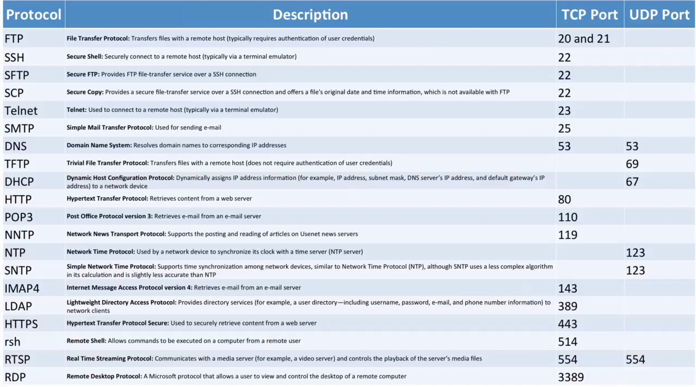
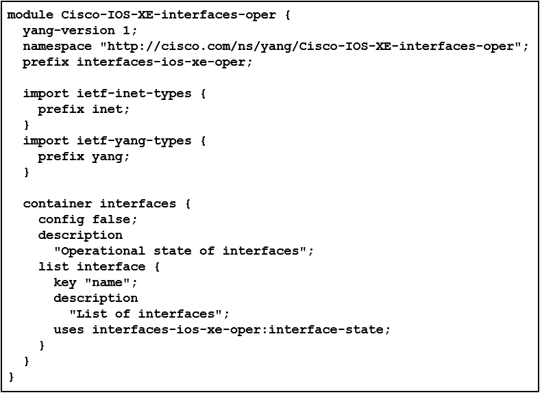
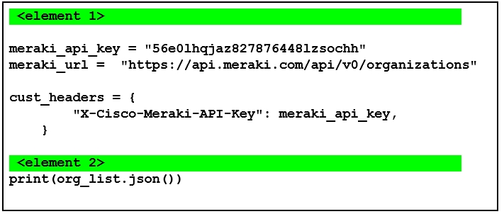

#   **Question 5**

What are the messages associated with the HTTP status codes shown in the answer area?  Drag each message to its associated status code.  Not every message will be used.

##  **Answer 5**

-   400:  Bad Request
-   401:  Unauthorized
-   403:  Forbidden
-   404:  Not Found

&nbsp;

#   **Question 10**

Which two virtualization deployment use a hypervisor?  (Choose two)

##  **Incorrect Answer 10**

-   Virtual machines
-   Containers

##  **Correct Answer 10**

-   Bare Metal
-   Virtual machines

##  **Explanation 10**

Virtual machines and bare metal virtualization deployments both use a hypervisor.  

A hypervisor is hardware, software, and/or firmware that sits between virtual machines and physical hardware.

Virtual machines run as guests on a host platform.  The host might be a normal operating system, such as Windows 10, running virtualization software, such as VMware Workstation.

Bare metal deployments run virtualization software directly on hardware by providing their own operating system, as VMware ESXi does.

Containers do **not** use a hypervisor and consist of an application or group of applications.  Containers provide many of the same benefits as virtual machines and are designed to be portable and largely self-contained.  They share a host operating system that manages kernel and device driver access.  Docker is a popular container ecosystem.

Serverless deployments do not necessarily use a hypervisor.  Serverless computing is another name for cloud computing.  Depending on the cloud architecture, a hypervisor may or may not be deployed.

&nbsp;

#   **Question 11**

An application attempts to add the same person to a Webex room multiple times.  Which error will the Webex API most likely return?

##  **Incorrect Answer 10**

429 Too Many Requests

##  **Correct Answer 10**

409 Conflict

##  **Explanation 11**

The Webex API will most likely return error 409 if an application attempts to add the same person to a Webex room multiple times.  Webex uses this error to indicate that the application is attempting to do something that would invalidate application or data integrity.  The error returned should provide additional details about the issue and may even suggest a remedy.

Error 405 means that the request was recognized, but the request method is invalid or does not exist.

Error 429 means the server has received more requests per unit of time than the server allows and has rate-limited the requester.

Error 403 means access to the requested resource has been denied, usually due to insufficient permission settings.

&nbsp;

#   **Question 13**

Which two features are provided by Cisco Unified Communications Manager (CUCM)?  (Choose two.)

##  **Incorrect Answer 13**

-   Administrative XML (AXL)
-   Policy-based Network Access

##  **Correct Answer 13**

-   Administrative XML (AXL)
-   Platform Administrative Web Services (PAWS)

##  **Explanation 13**

PAWS and AXL are both features of CUCM.  PAWS facilitates automated server upgrades, while AXL provides Simple Objects Access Protocol (SOAP) Application Programming Interfaces (APIs) that facilitate programmatic CUCM management and configuration.

Policy-based Network Access is not a feature provided by CUCM.  This is a feature of Cisco Identity Services Engine (ISE).

Workload Optimizer is not a feature provided by CUCM.  This is a feature of Cisco Intersight.

&nbsp;

#   **Question 15**

The develop and test phase is the focus of which popular software development approach?

##  **Incorrect Answer 15**

Continuous delivery

##  **Correct Answer 15**

Continuous integration

##  **Explanation 15**

Continuous integration focuses on the develop and test phase of software development.  Continuous integration is part of the Continuous Integration/Continuous Delivery (CI/CD) pipeline.  As developers create or change code, changes are merged to the central repository.  This triggers extensive, automated code testing.  Such testing prevents major bugs from developing as code is continuously merged with the main branch.

Continuous delivery does not focus on the develop and test phase of software development.  Continuous delivery means functional code that can be deployed at any time because it has been thoroughly tested.

Continuous testing does not focus on the develop and test phase of software development.  Testing is an important part of software development and is integral to the CI/CD pipeline, but continuous testing is not a popular software development approach.

Continuous iteration does not focus on the develop and test phase of software development.  Continuous iteration is not a popular software development approach.

&nbsp;

#   **Question 23**

Which language is required in order to run a Python unit test using pyATS?

##  **Incorrect Answer 23**

JSON

##  **Correct Answer 23**

YAML

##  **Explanation 23**

YAML Ain't Markup Language (YAML) is required in order to run a Python unit test using Python Automated Test Systems (pyATS).  YAML is a human-readable data formatting and presentation language.  Its purpose is similar to that of Extensible Markup Language (XML).  YAML files should be stored with the .yaml extension.  Similar to JavaScript Object Notation (JSON).  YAML data is often stored in key-value pairs, although this is not mandatory.

pyATS is a Cisco-developed network validation platform that facilitates automated device configuration retrieval, configuration comparison, and device testing using testbed files.  The testbed file provides information about target devices, including formation about Application Programming Interface (API) and communication methods.  The testbed file is written in YAML format.

JavaScript Object Notation (JSON) is a formatting language for exchanging and storing data.  JSON consists of key-value pairs, which are double-quoted elements separated by a colon and enclosed in curly braces.  JSON is frequently used to format data sets sent to and received from APIs.

Yet Another Next Generation (YANG) is a data modeling language.  The YANG language was originally designed for describing networking data models, such as the components and features of a router.  However, it can be used to describe other data models as well.

gRPC Remote Procedure Call (gRPC) is a high-performance framework that facilitates low-latency communication between devices and applications.  gRPC remote procedure calls carry gRPC Network Management Interface (gNMI), which is a network management protocol used to install and manage network device configuration.

&nbsp;

#   **Question 25**

Which of the following are principles of the Lean software development process?  (Choose two.)

##  **Answer 25**

-   Creating knowledge
-   Verifying each phase
-   **Welcoming change**
-   **Eliminating waste**

##  **Correct Answer 25**

-   Creating Knowledge
-   **Eliminating waste**

##  **Explanation 25**

Eliminating waste and creating knowledge are both principles of Lean software development.  Lean principles were originally designed to increase the efficiency of the manufacturing process.  Lean principles and practices have been expanded to other processes, including software development, and focus on optimizing all aspects of the development process.  Lean is sometimes referred to as an Agile method (Lean-Agile).  For the purposes of this Cisco exam, Lean and Agile methods share some similar characteristics but have distinct principles.

Welcoming change is a principle of the Agile software development process.  Agile is meant to be a flexible, customer-focused process that entails high levels of collaboration as software is developed organically.  This includes welcoming change, even in later development phases.

Verifying each phase is a principle of the Waterfall software development model.  Waterfall is a rigid model in which each phase is well defined, and the project only moves forward as each phase is completed and verified.

&nbsp;

#   **Question 27**

Which modeling language does Cisco IOS XR use to facilitate model driven programmability for infrastructure automation?

##  **Options 27**

-   YANG
-   RESTCONF
-   SNMP
-   **NETCONF**

##  **Correct Answer 27**

YANG

##  **Explanation**

Yet Another Next Generation (YaNG) is the modeling language Cisco IOS XR uses to facilitate model driven programmability for infrastructure automation.  YANG is used to abstract complex systems, such as routers, into readable hierarchies that can be queried using other protocols.  A YANG model serves as a blueprint to a device or system.  There are two types of YANG models: open and native.  Open models are developed and maintained by standards bodies, such as Internet Engineering Task Force (IETF).  Native models are developed and maintained by vendors, such as Cisco.

The NETCONF protocol is primarily used with YANG data models to install, modify, and delete network device configurations.  NETCONF sends and receives configuration data over Secure Shell (SSH) using Extensible Markup Language (XML) encoding.

RESTCONF is similar to NETCONF but was designed to provide REST-like Application Programming Interface (API) access to network device configurations.  NETCONF and RESTCONF use YANG models as a basis for understanding and traversing device configuration options, default settings, and expected return values.

Simple Network Management Protocol (SNMP) collects information from and manages network devices.

&nbsp;

#   **Question 29**

Drag each protocol or service to its associated standard port number.

##  **Correct Answer 29**

-   22:  SSH
-   23:  Telnet
-   80:  HTTP
-   443:  HTTPS

##  **Explanation 29**

Hypertext Transfer Protocol (HTTP) uses port 80.  Web servers use port 80 to serve content.

Hypertext Transfer Protocol Secure (HTTPS) uses port 443.  Web servers use port 443 to securely serve content via Secure Socket Layer (SSL) or Transport Layer Security (TLS).

Telnet uses port 23.  Telnet was the predecessor to Secure Shell (SSH) and is used to remotely manage nodes.  However, Telnet traffic - including usernames and passwords - is sent as clear text.

SSH uses port 22.  SSH is used to securely manage remote nodes.

> ***Added a list of ports to study since I couldn't find them in the book.***
> 
> 

&nbsp;

#   **Question 31**

If verification is required at the conclusion of each project phase, which software development model is being followed?

##  **Answers**

-   Waterfall software development
-   Lean software development
-   Rapid Application Development (RAD)
-   **Agile software development**

##  **Correct Answer**

Waterfall software development

##  **Explanation**

The waterfall software development model requires verification at the conclusion of each project phase.  Waterfall is a rigid model in which each phase is well defined, and the project only moves forward as each phase is completed and verified.

Agile software development does not require verification at the conclusion of each project phase.  Agile is meant to be a flexible, customer-focused process that entails high levels of collaboration as software is developed organically.

Lean software development does not require verification at the conclusion of each project phase.  The Lean model focuses on eliminating waste and maximizing value to the customer.

Rapid Application Development (RAD) does not require verification at the conclusion of each project phase.  RAD focuses on quickly building prototypes without detailed planning on verification processes.

&nbsp;

#   **Question 35**



Given the YANG model in the exhibit, which URL would be used in a RESTCONF query to retrieve interface information from an IOS-XE device?

##  **Answers**

-   **`https://10.10.10.11/restconf/data/Cisco-IOS-XE/interfaces-oper/interfaces`**
-   `https://10.10.10.11:interfaces/restconf/data/Cisco-IOS-XE-interfaces.oper`
-   `https://10.10.10.11/restconf/data/Cisco-IOS-XE-interfaces-oper/container_interfaces`
-   `htttps://10.10.10.11/restconf/data/Cisco-IOS-XE-interfaces-oper:interfaces`

##  **Correct Answer**

`https://10.10.10.11/restconf/data/Cisco-IOS-XE-interfaces-oper:interfaces`

##  **Explanation**

Given the YANG model in the exhibit, the following URL would be used in a RESTCONF query to retrieve interface information from an IOS-XE device:

`https://10.10.10.11/restconf/data/Cisco-IOS-XE-interfaces-oper:interfaces`

YANG is a data modeling language that abstracts complex systems, such as routers, into readable hierarchies that can be queried using other protocols.  A YANG model serves as a blueprint to a device or system.  There are two types of YANG models:  open and native.  Open models are developed and maintained by standards bodies, such as IETF.  Native models are developed and maintained by vendors, such as Cisco.  The YANG model snippet in the exhibit - Cisco-IOS-XE-interfaces-oper- is a native model that describes interfaces on an IOS-XE device.  Most devices have many models, each focusing on a particular feature, with each model often containing hundreds of lines of text.

The following URL is incorrect between the interfaces container must be specified after the model name:

`https://10.10.10.11:interfaces/restconf/data/Cisco-IOS-XE-interfaces-oper`

The following URL is incorrect because container_interfaces is not a valid container name in this model:

`https://10.10.10.11/restconf/data/Cisco-IOS-XE-interfaces-oper/container_interfaces`

The following URL is incorrect because the interfaces container must be specified after the module name, separated by a colon:

`https://10.10.10.11/restconf/data/Cisco-IOS-XE-interfaces-oper/interfaces`

> All RESTCONF URIs use the following format:
> 
> **`https://<ADDRESS>/<ROOT>/data/<[YANG_MODULE:]CONTAINER>/<LEAF>[?<OPTIONS>]`**
> 
> Chapter 12 has additional YANG/RESTCONF information

&nbsp;

#   **Question 37**

Which of the following is done in the edge computing infrastructure model?

##  **Answers**

-   Consolidate edge data processing and business intelligence in the cloud.
-   Move API compute and storage resources to on-premises data centers.
-   **Deploy firewalls with advanced security policies at the network edge.**
-   Locate some processing and data storage capacity near edge devices.

##  **Correct Answer**

Locate some processing and data storage capacity near edge devices.

##  **Explanation**

Locating some processing and data storage capacity near edge devices correctly describes one approach taken in edge computing.  As the name indicates, edge computing is designed to decentralize parts of an application's compute and storage needs.  This in turn reduces latency and decreases cloud computing resource needs.  In an extreme example, a self-driving vehicle generates and consumes enormous amounts of data.  If all this data had to be sent to the cloud, the latency would render most self-driving capabilities inoperable.

Firewalls often do sit at the boundary - or edge - of private (LAN) and public (the Internet) networks.  These devices are sometimes called edge devices.  However, deploying firewalls at the edge is not an approach taken in edge computing.

Consolidating edge data processing and business intelligence in the cloud is the antithesis of edge computing.  While the cloud is often still an important component in an edge computing model, this statement does not describe an approach taken in edge computing.

Moving API compute and storage resources to on-premises data centers does not describe edge computing.  On-premises data center resources may or may not be utilized in an edge computing architecture.

&nbsp;

#   **Question 39**

Which is a benefit of creating Python classes?

##  **Answers**

-   Code immutability
-   Code encapsulation
-   Code expansion
-   **Code redundancy**

##  **Correct Answer**

Code encapsulation

##  **Explanation**

Code encapsulation is a benefit of creating Python classes.  Classes serve as a blueprint for creating objects in code.  Using classes allows code to be grouped into functional units that make the code highly reusable and easier to read.  Modules, functions, and procedures all provide similar benefits.

Code immutability is not a benefit of creating Python classes.  In programming, immutable objects cannot be changed once created.  Immutability is principle of DevNetOps - where network infrastructure and operations are abstracted into code.  The goal of immutability is to ensure predictable, consistent operations by prohibiting code changes to production systems.  In DevNetOps, if a code or configuration change needs to be implemented, the existing node is retired and a new node with the desired changes is initialized.

Code redundancy is not a benefit of creating Python classes.  Classes are designed to reduce code redundancy by facilitating easy reuse.  While eliminating code redundancy is a programming best practice, system redundancy is often highly sought after, because it ensures that no single failure will result in an interruption of services.  Server clusters and load balancers are elements in a redundant system design.

Code expansion is not a benefit of creating Python classes.  Classes are designed to reduce the amount of code an application requires by encapsulating reusable logic.  Code reduction or simplification is considered a programming best practice.  Unnecessarily complicated code is harder to read, harder to maintain, and more prone to bugs.

&nbsp;

#   **Question 45**

What is the most likely reason an organization might deploy a hybrid cloud?

##   **Options**

-   To augment on-premises resources by providing overflow capacity
-   To ensure charges are only incurred when cloud resources are utilized
-   **To eliminate the need for locally hosted compute resources**
-   To consolidate all cloud resources to a single data center

##  **Correct Answer**

To augment on-premises resources by providing overflow capacity

##  **Explanation**

An organization might deploy a hybrid cloud to augment on-premises resources by providing overflow capacity.  In the hybrid cloud model, the organization does not control all resources.  A hybrid cloud is the combination of two or more cloud models, such as public and private.  In this scenario it appears the organization hosts on-premises, private cloud resources, but would like to augment this with public cloud capacity.  This is a common cloud implementation model.

Consolidating all resources to a single data center is not the most likely reason an organization would deploy a hybrid cloud.  This more accurately describes either a public or private cloud.

Ensuring charges are only incurred when cloud resources are utilized is not the most likely reason an organization would deploy a hybrid cloud.  This more accurately describes either a public or private cloud.

Eliminating the need for locally hosted compute resources is not the most likely reason an organization would deploy a hybrid cloud.  While it is possible for hybrid cloud resources to be hosted off-premises, this is not a common deployment model.

&nbsp;

#   **Question 48**

Which two statements are principles of test-driven Development?  (Choose two.)

-   **Functionally test small units of code.**
-   **Create code tests before writing application code.**
-   Ensure that code units work as a complete application
-   Continuously refactor and improve code.

##  **Correct Answer**

-   **Create code tests before writing application code.**
-   Continuously refactor and improve code.

##  **Explanation**

Continuously refactoring and improving code as it is tested and creating code tests before writing code are principles of test-driven deployment (TDD).  this approach ensures that an application is written to be testable and has been thoroughly tested, resulting in fewer undiscovered bugs.

The primary purpose of TDD is to create highly usable software.  To accomplish this, TDD emphasizes running simple tests around small units of code, which encourages developers to code with the primary goal of passing the next unit test.  Once the first round of coding is completed, the code is tested.  If it passes, the developer moves on to the next code unit.  However, as long as code fails any testing, it is refactored and improved until failures are no longer encountered.

Ensuring that individual code units work together in a complete application is not a principle of test-driven development.  This concept is known as integration testing.

Functionally testing small units of code in a detailed manner is not a principle of test-driven development  This concept is known as unit testing.

> Chapter 5 has Test-Drive Deployment
> 
> 

&nbsp;

#   **Question 52**

Which element is required in every POST request to the IOS XE REST API?

##  **Options**

-   A password
-   **An endpoint IP address**
-   An explicit port
-   A JSON body

##  **Correct Answer**

A JavaScript Object Notation (JSON) body is required in every POST request to the IOS XE REST Application Programming Interface (API).  The JSON-formatted body provides the information that the POST method requires to perform a requested action, including details about the action itself.

An explicit port is not required in every POST request to the IOS XE REST API.  A Uniform Resource Identifier (URI) often indicates the protocol that will be used in an API call, usually Hypertext Transfer Protocol (HTTP) or Hypertext Transfer Protocol Secure (HTTPS).  These protocols inherently use port 80 or 443 respectively.

An endpoint IP address is not required in every POST request to the IOS XE REST API.  A URI, which is comparable to a Uniform Resource Locator (URL), is required, because it provides a path to a target service endpoint.  URIs usually include a hostname that is resolved to an Internet Protocol (IP) address via Domain Name System (DNS).

A password is not required in every POST request to the iOS XE REST API.  depending on how an API call is made, authentication is typically API-key or token based.  In any case, passwords should not be sent with POST requests.

&nbsp;

#   **Question 56**
<details>
<summary>Exhibit</summary>



</details>

Which two elements are required to complete the Meraki API call made by the Python script/  (Choose two.)

> Note I didn't see the exhibit so I misunderstood what the question was asking.  After seeing the exhibit I better understood and got it correct.

##   **Options**

-   **'Authorization': 'Bearer {}'.format(meraki_api_key)**
-   networks = requests.get(url, headers=headers)
-   **import requests**
-   'Content-Type': 'application/json'
-   org_list = requests.get(meraki_url,headers=cust_headers)

##  **Correct Answer**

-   **import requests**
-   org_list = requests.get(meraki_url,headers=cust_headers)

&nbsp;

#   **Question 57**

What do the following Bash commands do?  (Choose two.)

```
if config > mydata
catmydata
```

##  **Options**

-   Display the contents of mydata in the terminal window.
-   List all categories of files containing mydata.
-   Create an environment cariable named ifconfig and set its value to mydata.
-   Concatenate the values held in mydata.
-   R**edirect the output of a command to the file mydata.**

##  **Correct Answers**

-   Display the contents of mydata in the terminal window.
-   **Redirect the output of a command to the file mydata.**

##  **Explanation**

The ifconfig > mydata command runs the ifconfig command and redirects the output to the file mydata.  The > operator is used to redirect output that would normally be printed to the terminal.  This is useful when the output is long or needs to be saved for later viewing.

The cat mydata command displays the contents of a file.

> The cat command reads one or more files and prints their contents to standard output.

To create an environment variable, you use the export command.

To search for data within files, you would use the grep command.

To concatenate variables, you need to list them sequentially.  For example, to concatenate and store the values held in $mydata1 and $mydata2 in the variable $mydata3, you would use the following:

`$mydata3="$mydata1$mydata2"`

> Despite it saying my answer is incorrect, the information for cat that is linked to says:
> cat
> Concatenate and print (display) the content of files
> Concatenate FILE(s), or standard input, to standard output.
> https://ss64.com/bash/cat.html

&nbsp;

#   **Question 64**

Which Intersight API component can be used to categorize managed objects.

##  **Options**

-   Tags
-   **Intent API**
-   NETCONF
-   ExCaP

##  **Correct Answer**

Tags

##  **Explanation**

Tags are an Intersight API component that can be used to categorize managed objects.  All managed object classes in Intersight support tagging.  These tags serve as customizable attributes and are stored under the Tags key in each managed object's JSON document.  Example tags include device location, point-of-contact, or other relevant information.  Cisco Intersight is a Software-as-a-Service (SaaS) infrastructure management platform that allows you to manage a cisco infrastructure.External Captive Portal (ExCaP) is not an Intersight API component.  ExCaP is a component of the Cisco Meraki cloud-managed networking infrastructure.  This component facilitates users joining a network.

Intent API is a component of Cisco DNA Center.  This component facilitates programmatic access to Cisco DNA Center's services.

The NETCONF protocol is used to install, modify, and delete network device configurations.  When a controller or other network management system interacts with a device using NETCONF, queries can be sent, responses received, and configuration information supplied using Extensible Markup Language (XML) encoded data.

&nbsp;

#   **Question 67**

What type of pyATS unit test file is shown below?

```yaml
==================
devices:
  RTR_ATLANTA:
    type: router
    os: iosxe
    credentials:
      default:
        username: "cisco"
        password: "cisco"
    connections:
      cli:
        protocol: ssh
        ip: "10.10.10.50"
  RTR_NYC:
    type: router
    os: iosxe
    credentials:
      default:
        username: "cisco"
        password: "cisco"
    connections:
      cli: protocol: telnet
      ip: "10.10.20.50"
      port: 1115
==================
```

##  **Options**

-   **An inventory file**
-   A Dockerfile
-   A testbed file
-   A playbook

##  **Correct Answer**

A testbed file

##  **Explanation**

This is a Python Automated Test Systems (pyATS) testbed file, which is used for unit testing.  pyATS is a Cisco-developed network validation platform that facilitates automated device configuration retrieval, configuration comparison, and device testing.  The testbed file provides information about target devices, including information about APIs and communication methods.  This testbed file is written in YAML Ain't Markup Language (YAML) format.

This is not a Dockerfile.  Dockerfiles provide the instructions required to build a Docker container.

This is not an inventory file.  Inventory files are used by Ansible to run playbooks against groups of hosts.  Though they contain information similar to that found in the testbed file, they are not compatible.

This is not a playbook.  An Ansible playbook is where Ansible code is stored.  This code tells Ansible what tasks it is to perform against which hosts or network nodes.

&nbsp;

#   **Question 69**

Which two lines represent the format of a unified diff's two-line header?  (Choose two.)

##  **Options**

-   +++ -3,12 + 3,14 +++
-   --- file1 2020-03-29 22:30:20:897472005 -0400
-   +++ file2 2020-03-29 22:45:10.844542835 -0400
-   **@@ -33,12 + 3,14 @@**
-   @@ file 2 2020-03-29 22:45:10.844542835 -0400 @@

##  **Correct Answer**

These lines represent the format of a unified diff's two-line header:

--- file1 2020-03-29 22:30:20.897472005 -0400

+++ file2 2020-03-29 22:45:10.844542835 -0400

Diff is a command in the GNU Diffutils package that is used to find differences between files.  Diff supports several output formats.  the unified format is considered the most compact.  The --- indicates the old files, or file1 in this case, and ends with a timestamp.  The +++ indices the new file, or file2 in this case, and ends with a timestamp.

@@ -3,12 +3,14 @@ is a correctly formatted hunk range indicator.  A hunk range indicator starts and ends with two at symbols - @@.  The pairs of numbers in the center represent the starting line number where the two files differ, and the number of lines included in this hunk.  The old file is listed first, indicated by a minus symbol, and the new file is listed second, indicated by a plus symbol.  In this case, starting at line 3 of the old file, 12 lines are included from the old file.  Starting with line 3 in the new file, 14 lines are included from the new file.

+++ -3,12 + 3,14 +++ combines elements from the header lines and the hunk range indicator.  This is not a valid unified diff line.

@@ file 2 2020-03-29 22:45:10.844542835 -0400 @@ also combines elements from the header lines and the hunk range indicator.  This is not a valid unified diff line.

&nbsp;

# **Question 71**

Which port is used by default to establish a connection to the NETCONF SSH subsystem?

##  **Options**

- 443
- 23
- **22**
- 830

##  **Correct Answer**

830

# **Explanation**

Port 830 is used by default to establish a connection to the NETCONF Secure Shell (SSH) subsystem.  This is stipulated by Request for Comments (RFC) 6242.  This requirement allows NETCONF traffic to be identified by firewalls.

Port 22 is used for SSH.  SSH is to securely manage remote nodes.

Port 23 is used for Telnet.  Telnet was the predecessor to SSH and is used to remotely manage nodes.  However, Telnet traffic - included usernames and passwords - is sent as clear text.

Port 443 is used for Hypertext Transfer Protocol Secure (HTTPS).  Web servers use port 443 to securely serve content via Secure Sockets Layer (SSL) or Transport Layer Security (TLS).

&nbsp;

# **Question 73**

Which action does the Cisco Threat Grid API support?

##  **Options**

- Malware analysis of user-submitted files
- **DNS-layer protection from suspicious domains**
- Advanced firewall rules for network protection
- Real-time alerting of system and network breaches

##  **Correct Answer**

Malware analysis of user-submitted files

##  **Explanation**

Cisco Threat Grid API supports malware analysis of user-submitted files.  Threat Grid aggregates threat data from Cisco's expansive internal and partner networks.  This aggregated data is analyzed to identify patterns in malware behavior and attack methods, resulting in threat intelligence and gleaned from hundreds of millions of samples.  Using the Threat Grid API, suspicious files can be manually or automatically submitted for analysis against this threat intelligence backdrop.  Threat Grid APIs can also push intelligence feeds to on-premises devices such as Intrusion Prevention Systems (IPS) to facilitate real-time response to emerging threats.

The Cisco Threat Grid API does not support advanced firewall rules for network protection.  This feature is provided by Cisco Next-generation Firewall (NGFW) Firepower platform.

The Cisco Threat Grid API does not support DNS-layer protection from suspicious domains.  This feature is provided by Cisco Umbrella.  Umbrella uses threat intelligence information to block access to Internet-based threats, such as malicious domains, IP addresses, files, and URLs.  This functionality is primarily provided by the Enforcement API.

The Cisco Threat Grid API does not support real-time alerting of system and network breaches.  However, Threat Grid can supply intelligence feeds to downstream devices that can use this information in real time to identify and alert on threats.

&nbsp;

# **Question 74**

Which two of the following are features of pyATS?  (Choose two.)

##  **Options**

- **Multi-vendor support**
- Network device automation
- **Network simulation**
- Cloud-hosted network management

##  **Correct Answer**

- **Multi-vendor support**
- Network device automation

##  **Explanation**

Multi-vendor support and network device automation are features of pyATS.  pyATS is a Python-based network automation and testing ecosystem.  pyATS is a Cisco-developed network validation platform that facilitates automated device configuration retrieval, configuration comparison, and device testing using testbed files.  The testbed file provides information about target devices, including information about APIs and communication methods.  This testbed file is written in YAML format.

Network simulation is not a feature of pyATS.  This functionality is provided by Cisco Virtual Internet Routing Lab (VIRL).

Cloud-hosted network management is not a feature of pyATS.  This functionality is provided by Cisco Intersight.

&nbsp;

##  **Question 76**

Which automation tool provides a system for treating infrastructure as code?

##  **Options**

- YANG
- Chef
- OWASP
- **Docker**

##  **Correct Answer**

Chef

##  **Explanation**

Chef is an automation tool that provides a system for treating infrastructure as code.  This capability is provided by the Chef Infra platform.  Among other uses, Chef can be used to automate the deployment and management of network, storage, and compute resources.  Chef provides similar functionality to Ansible.

Docker is used to deliver software packages in containers.

Open Web Application Security Project (OWASP) is an organization that works to improve software security.

Yet Another Next Generation (YANG) is a data modeling language.

&nbsp;

# **Question 79**

Which of the following is a feature of model-driven programmability for infrastructure automation?

##  **Options**

- Proactive, need-based resource provisioning
- Next-generation firewall implementation and traffic inspection
- Dynamic malware capture and signature analysis
- AI-driven, on-the-fly code creation and testing

##  **Correct Answer**

Proactive, need-based resource provisioning

##  **Explanation**

Proactive, need-based resource provisioning is a feature of model-driven programmability for infrastructure automation.  Based on traffic loads, network automation can be used to dynamically limit existing resource usage or provision additional network devices on an as-needed basis.

AI-driven, on-the-fly code creation and testing is not a feature of model-driven programmability for infrastructure automation.  Currently, AI-assisted coding is being used to increase development efficiency by making inline code completion suggestions as programmers write code.

Next-generation firewall (NGFW) implementation and traffic inspection is not a feature of model-driven programmability for infrastructure automation.  Cisco's Firepower product line offers advanced NGFW features, but its use is not required for model-driven programmability for infrastructure automation.

Dynamic malware capture and signature analysis is not a feature of model-driven programmability for infrastructure automation.  Cisco's Advanced Malware Protection (AMP) platform offers this capability.

&nbsp;

# **Question 84**

Which deployment model does not readily facilitate workload isolation?

##  **Options**

- Bare metal
- Virtual machines
- Container-based
- **Serverless**

##  **Correct Answer**

Bare metal

##  **Explanation**

The bare metal deployment model does not readily facilitate workload isolation.  A bare metal installation is done directly on a target hardware system.  As a result, all applications share physical resources, which cannot be easily constrained on a per-application or workload basis.

Virtual machines readily facilitate workload isolation.  They allow operating systems and applications to be isolated from one another.  Additionally, the hypervisor facilitates limiting the amount of compute, network, and storage resources each virtual machine can consume.

Container-based deployments readily facilitate workload isolation.  Containers provide many of the same benefits as virtual machines, including the ability to isolate workloads and limit resource usage.

Serverless computing is another name for cloud computing.  Depending on the cloud model chosen, workload isolation may or may not be possible.

&nbsp;

# **Question 88**

Which command would be used to download the base IR800 from the Cisco repository?

##  **Options**

- From devhub-docker.cisco.com/iox-docker/ir800/base-rootfs:latest
- DOWNLOAD devhub-docker.cisco.com/iox-docker/ir800/base-rootfs:latest
- **GET devhub-docker.cisco.com/iox-docker/ir800/base-rootfs:latest**
- PULL devhub-docker.cisco.com/iox-docker/ir800/base-rootfs:latest

##  **Correct Answer**

FROM devhub-docker.cisco.com/iox-docker/ir800/base-rootfs:latest

##  **Explanation**

The following command would be used to download the base IR800 from the Cisco repository:

FROM devhub-docker.cisco.com/iox-docker/ir800/base-rootfs:latest

The FROM command specifies the base image used to build a container, and a base image can be pulled from a public or private repository.  Devhub-docker.cisco.com is a publicly hosted repository managed by Cisco.  Once a base image is downloaded, additional commands can be executed to customize the configuration services of a container.  The FROM command is required and is always the first instruction in a Dockerfile.

The other commands are not valid Dockerfile commands.

&nbsp;

# **Question 89**

Based on the unified diff output, how many lines are included from file1?

```
--- file1 2020-01-01 12:30:00.000000000 -0400
+++ file2 2020-01-01 12:40:00.000000000 -0400
@@ -4,3 +4,4 @@

The quick brown fox jumps over the lazy dog.
The lazy dog jumps over the quick brown fox.
+The slow gray fox jumps over the happy dog.
```

##  **Options**

- **One**
- Three
- Two
- Four

##  **Correct Answer**

Three

##  **Explanation**

Based on the unified diff output, three lines are included from file1.

Diff is a command in the GNU Diffutils package that is used to find differences between files.  Diff supports several output formats.  The unified format is considered the most compact.  The --- indicates the old file, or file1 in this case, and ends with a timestamp.  The +++ indicates the new file, or file2 in this case, and ends with a timestamp.

Line three from the unified diff output can be used to determine the number of lines included from file1.  This is known as a hunk range indicator.  A hunk range indicator starts and ends with two at symbols - @@.  The pairs of numbers in the center represent the starting line number where the two files differ, and the number of lines included in this hunk.  The old file is listed first, indicated by a minus symbol, and the new file is listed second, indicated by a plus symbol.  In this case:

Starting at line 4 of the old file, 3 lines are included from the old file.  Starting at line 4 in the new file, 4 lines are included from the new file.

&nbsp;

# **Question 90**

Which statement regarding container-based infrastructure is true?

##  **Options**

- Containers host an internal kernel and customized device drivers.
- Containers store all binaries with a common hypervisor.
- Containers consist of applications or groups of applications.
- Containers have direct, unmitigated access to compute resources.

##  **Correct Answer**

Containers consist of applications or groups of applications.

##  **Explanation**

Containers consist of applications or groups of applications.  Containers provide many of the same benefits as virtual machines and are designed to be portable and largely self-contained.

Containers do not host an internal kernel and customized device drivers.  Containers share a host operating system that manages kernel and device driver access.

Containers do not have direct, unmitigated access to computer resources.  Containers share a host operating system that manages access to compute resources.

Containers do not store all binaries with a common hypervisor.  They are designed to be portable and therefore contain the code (binaries), settings, tool,s and dependencies required to functions.

&nbsp;

# **Question 94**

Where is a server's MAC address stored?

##  **Options**

- The server's TCP/IP configuration
- **The switch's layer 2 configuration file**
- The server's network interface card
- The default gateway's routing table

##  **Correct Answer**

The server's network interface card

##  **Explanation**

The server's Media Access Control (MAC) address is stored in the server's network interface card (NIC).  The MAC address, sometimes called the burned-in address or the NIC hardware address, is assigned by the NIC's manufacturer.  The MAC address is globally unique but is used to identify the server on the local subnet or network segment.

A server's MAC address is not stored in the default gateway's routing table.  Routing tables do not store MAC addresses, but they do store IP routes and addresses.

A server's MAC address is not stored in a switch's layer 2 configuration file.  If the server is connected to the switch, its MAC address will likely be stored temporarily in the switch's MAC address table and will be used to make switching decisions.

A server's MAC address is not stored in the server's TCP/IP configuration.  A MAC address is considered Open Systems Interconnection (OSI) model layer two information.  TCP/IP functions at layers three and four of the OSI model.

&nbsp;

# **Question 100**

Which infrastructure automation technology can be used to identify changes in network configurations?

##  **Options**

- Cisco Virtual Internet Routing Laboratory
- Genie
- Intent API
- Cisco Unified Communications Manager

##  **Correct Answer**

Genie is an infrastructure automation technology that can be used to identify changes in network configurations.  Genie is part of Cisco's Python Automated Test Systems (pyATS) ecosystem and provides API access to network device information and configuration.

Cisco Virtual Internet Routing Laboratory (VIRL) is not an infrastructure automation technology that can be used to identify changes in network configurations.  VIRL facilitates network design and simulation.

Cisco Unified Communications Manager (UCM) is not an infrastructure automation technology that can be used to identify changes in network configurations.  UCM facilitates the management of Internet Protocol (IP) telephony, including call control, user management, and directory management.

Intent Application Programming Interface (API) is not an infrastructure automation technology that can be used to identify changes in network configurations.  Intent API is a component of Cisco Digital Network Architecture (Cisco DNA) which facilitates programmatic access to Cisco DNA Center's services.